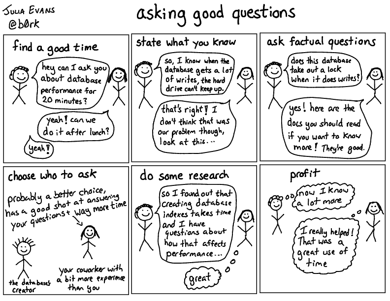

# Cách đặt câu hỏi

Bài viết được dịch từ [How to ask good questions](https://jvns.ca/blog/good-questions/)

Việc **đặt câu hỏi hay** là một kỹ năng siêu quan trọng khi viết phần mềm. Tôi đã trở nên giỏi hơn rất nhiều trong lĩnh vực này qua các năm (đến mức đồng nghiệp thường khen). Dưới đây là một số nguyên tắc tôi thấy rất hiệu quả

### Hỏi những câu “dở hơi” cũng không sao

Tôi tin rằng đặt những câu hỏi ngốc nghếch hoặc không “hay” cũng không vấn đề gì. Tôi thường hỏi mọi người những câu đơn giản mà thực ra tôi có thể tự tìm qua Google hoặc trong codebase. Tôi cố gắng không lặp lại, nhưng nếu vẫn hỏi thì cũng chẳng sao.

Các chiến lược dưới đây không nhằm nói "bạn phải làm mọi bước này trước khi hỏi". Mà là “đây là thứ giúp tôi đặt câu hay hơn và nhận được câu trả lời tôi cần”

Nếu ai đó từ chối trả lời bạn vì câu hỏi không “đủ hay”, có thể họ cần học cách trả lời đúng hơn—tôi từng viết bài [How to answer questions in a helpful way](https://jvns.ca/blog/answer-questions-well/).

### Câu hỏi hay là gì?

Mục tiêu của chúng ta là đặt ra những câu hỏi dễ trả lời về các khái niệm kỹ thuật. Tôi thường có một người đi cùng, người này có rất nhiều kiến thức mà tôi cũng muốn biết, nhưng không phải lúc nào họ cũng biết cách giải thích chính xác nhất cho tôi.

Nếu tôi đặt ra một loạt câu hỏi hay, tôi có thể giúp người đó giải thích những gì họ biết một cách hiệu quả và hướng dẫn họ nói với tôi những điều tôi quan tâm.

### Nói rõ bạn biết gì rồi

Câu hỏi có dạng:

1. Nêu điều bạn hiểu đến lúc này.
2. Hỏi "Tôi hiểu vậy có đúng không?”

Ví dụ, tôi thấy `rkt` dùng nhiều dung lượng hơn Docker. Tôi hiểu **cách** code hoạt động, nhưng không hiểu **tại sao**. Vậy nên tôi đã gửi câu hỏi này lên mailing list của `rkt-dev`: [Why does rkt store container images differently from Docker?](https://groups.google.com/forum/#!topic/rkt-dev/bhGeR3pUfPY):

- Viết ra hiểu biết của tôi về cách cả rkt và Docker lưu trữ container trên đĩa
- Đưa ra một vài lý do mà tôi nghĩ họ có thể đã thiết kế theo cách đó.
- Chỉ hỏi "Ý hiểu của tôi có đúng không?"

Câu trả lời tôi nhận được thực sự rất hữu ích, chính xác là những gì tôi đang tìm kiếm. Phải mất khá nhiều thời gian để tôi hình thành câu hỏi theo cách mà tôi thấy hài lòng, và tôi vui vì đã dành thời gian vì điều đó giúp tôi hiểu rõ hơn những gì đang xảy ra.

Nêu rõ những gì bạn đã hiểu không dễ (Bạn cần phải bỏ thời gian để nghĩ xem bạn biết gì và làm rõ suy nghĩ của bạn) — nhưng cực kỳ hiệu quả, và giúp người được hỏi hỗ trợ bạn tốt hơn.

### Hỏi câu có câu trả lời là 1 fact

Nhiều câu hỏi tôi đặt ban đầu rất mơ hồ—như “SQL join hoạt động ra sao?” — rất khó trả lời vì quá rộng. 

Tôi thích đặt những câu hỏi mà câu trả lời là một fact (sự thật hiển nhiên). Ví dụ, trong ví dụ về phép nối SQL của chúng ta, một số câu hỏi có fact để trả lời có thể là:

* Độ phức tạp thời gian của việc join hai bảng kích thước N và M là gì? O(NM)? Hay O(NlogN)+O(MlogM)?
* MySQL có luôn sắp xếp cột join trước khi thực hiện không?
* Khi join giữa cột có index và không có index, có cần sắp xếp cột không có index không?

Khi tôi hỏi những câu hỏi siêu cụ thể như thế này, người tôi hỏi không phải lúc nào cũng biết câu trả lời (điều này không sao cả!!) nhưng ít nhất họ hiểu loại câu hỏi mà tôi quan tâm - chẳng hạn như, rõ ràng là tôi không quan tâm đến cách sử dụng lệnh `join`, tôi muốn hiểu đôi chút về chi tiết triển khai và các thuật toán.

### Sẵn sàng nói ra điều bạn không hiểu

Thường thì khi ai đó giải thích điều gì đó cho tôi, họ sẽ nói điều gì đó mà tôi không hiểu. Ví dụ, có người giải thích về cơ sở dữ liệu với tôi và nói "À, chúng tôi sử dụng `optimistic locking` với MySQL, và vì vậy...". Tôi không biết `optimistic locking` là gì. Vậy nên đó sẽ là thời điểm thích hợp để hỏi! :)

Khả năng dừng ai đó lại và hỏi "Này, cái này có nghĩa là gì?" là một kỹ năng cực kỳ quan trọng. Tôi nghĩ đó là một trong những phẩm chất của một kỹ sư tự tin và là một điều tuyệt vời để phát triển. Tôi thấy rất nhiều kỹ sư cao cấp thường xuyên yêu cầu làm rõ - tôi nghĩ khi bạn tự tin hơn vào kỹ năng của mình, việc này sẽ dễ dàng hơn.

Càng thực hiện điều này, tôi càng cảm thấy thoải mái hơn khi yêu cầu ai đó làm rõ. Thực tế, nếu ai đó không hỏi tôi khi tôi đang giải thích điều gì đó, tôi lo rằng họ không thực sự lắng nghe!

Điều này cũng tạo cơ hội cho người trả lời câu hỏi thừa nhận khi họ đã hiểu hết kiến thức của mình! Rất thường xuyên khi tôi hỏi ai đó một câu hỏi, tôi sẽ hỏi những điều họ không biết. Những người tôi hỏi thường rất giỏi trả lời "không, tôi không biết điều đó!"

### Xác định thuật ngữ bạn **chưa** hiểu

Khi bắt đầu công việc hiện tại, tôi làm việc trong nhóm dữ liệu. Khi tôi bắt đầu tìm hiểu về công việc mới, tôi thấy rất nhiều thuật ngữ, nào là Hadoop, Scalding, Hive, Impala, HDFS, zoolander, v.v. Có lẽ tôi đã từng nghe nói đến Hadoop trước đây nhưng về cơ bản tôi không biết bất kỳ thuật ngữ nào trong số này có nghĩa là gì. Một số thuật ngữ là của các dự án nội bộ, một số là của các dự án nguồn mở. Vì vậy, tôi bắt đầu bằng cách nhờ mọi người giúp tôi hiểu ý nghĩa của từng thuật ngữ và mối quan hệ giữa chúng. Một số câu hỏi tôi có thể đã hỏi:

- HDFS có phải là cơ sở dữ liệu không? (không, nó là một hệ thống tệp phân tán)
- Scalding có sử dụng Hadoop không? (có)
- Hive có sử dụng Scalding không? (không)

Tôi thực sự đã viết một "từ điển" về tất cả các thuật ngữ vì có quá nhiều thuật ngữ, và việc hiểu ý nghĩa của tất cả các thuật ngữ thực sự đã giúp tôi định hướng bản thân và đặt ra những câu hỏi tốt hơn sau này.

### Nghiên cứu trước khi hỏi

Ví dụ tôi tìm “how are sql joins implemented” rồi đọc vài bài blog, biết rằng có sắp xếp, có hash join, nên tôi mới nghĩ ra các câu hỏi cụ thể hơn. Tìm hiểu trước giúp bạn hỏi tốt hơn.

Nhưng không phải lúc nào bạn cũng phải Google — đôi khi trong lúc ăn trưa hỏi đồng nghiệp câu cơ bản cũng OK. Tuy nhiên, tìm hiểu trước thường rất hữu ích và thú vị — và giúp bạn có các câu hỏi chất hơn.

### Chọn người phù hợp để hỏi

Trong team, tôi thường cân nhắc những điều sau trước khi hỏi các đồng nghiệp (vì tôi dành phần lớn thời gian ở đó):

* Họ có đang bận không? Nếu họ đang bạn việc”, thì không nên hỏi ngay.
* Câu hỏi có tiết kiệm thời gian cho bạn hơn so với thời gian họ bỏ ra không? VD: Nếu họ trả lời trong 5 phút mà bạn tiết kiệm được 2 giờ, thì rất đáng.
* Họ sẽ mất bao lâu để trả lời câu hỏi của tôi? Nếu tôi có nửa tiếng để hỏi, tôi có thể muốn sắp xếp một khoảng thời gian riêng với họ sau. Nếu tôi chỉ có một câu hỏi nhanh, có lẽ tôi có thể hỏi ngay bây giờ.
* Liệu người này có quá "cao cấp" (seniỏ) cho câu hỏi này không? Tôi nghĩ rằng thật dễ dàng để rơi vào cái bẫy là hỏi người giàu kinh nghiệm/hiểu biết nhất mọi câu hỏi bạn có về một chủ đề. Nhưng thường thì tốt hơn là tìm một người ít hiểu biết hơn một chút - thường thì họ thực sự có thể trả lời hầu hết các câu hỏi của bạn, điều này giúp phân tán gánh nặng và họ có thể thể hiện kiến thức của mình (điều này thật tuyệt).

Tôi không phải lúc nào cũng chọn đúng, nhưng việc suy nghĩ về những điều này rất hữu ích.

Ngoài ra, tôi thường dành nhiều thời gian hơn để hỏi những người mà tôi thân thiết hơn – có những người tôi nói chuyện gần như mỗi ngày, và tôi thường có thể dễ dàng hỏi họ những câu hỏi vì họ hiểu rõ những gì tôi đang làm và có thể dễ dàng đưa ra cho tôi những câu trả lời hữu ích.

### Hỏi để chỉ ra điều chưa rõ ràng

Một hình thức đặt câu hỏi nâng cao hơn là đặt câu hỏi để tiết lộ những giả định hoặc kiến thức ẩn giấu. Loại câu hỏi này thực sự có hai mục đích:

1. Để có được câu trả lời (có thể có thông tin mà một người có mà người khác không có!)
2. Cho người khác thấy là có thông tin ẩn, và việc chia sẻ nó hữu ích.

Ví dụ từ phần "Nghệ thuật Đặt câu hỏi" trong [Etsy Debriefing Facilitation Guide](https://extfiles.etsy.com/DebriefingFacilitationGuide.pdf):

> "Bạn tìm kiếm những điều gì khi nghi ngờ loại lỗi này đã xảy ra?"
> "Làm thế nào bạn đánh giá rằng tình huống này là 'bình thường'?"
> Làm thế nào bạn biết rằng cơ sở dữ liệu đã ngừng hoạt động?
> Làm thế nào bạn biết đó là nhóm bạn cần liên lạc?

Những câu hỏi kiểu này (có vẻ khá cơ bản, nhưng thực ra không hề hiển nhiên) đặc biệt hiệu quả khi được một người cấp trên đặt ra. Tôi rất thích khi một quản lý/kỹ sư cấp cao hỏi một câu hỏi cơ bản nhưng quan trọng như "làm sao bạn biết cơ sở dữ liệu đã bị sập?", vì nó tạo điều kiện cho những người cấp dưới có thể hỏi những câu hỏi tương tự sau này.

### Hãy **trả lời** những câu hỏi

Một phần tôi thích trong bài “How to Contribute to Open Source” của André Arko là:

> Bây giờ bạn đã đọc hết các issues and pull requests, hãy bắt đầu chú ý đến những câu hỏi mà bạn có thể trả lời. Sẽ không mất quá nhiều thời gian để bạn nhận ra ai đó đang hỏi một câu hỏi đã được trả lời trước đó, hoặc đã được trả lời trong các tài liệu mà bạn vừa đọc. Hãy trả lời những câu hỏi mà bạn biết cách trả lời.

Nếu bạn đang bắt đầu một dự án mới, việc trả lời câu hỏi từ những người đang học những thứ bạn vừa học có thể là một cách thực sự tuyệt vời để củng cố kiến thức của bạn. Mỗi khi trả lời một câu hỏi về một chủ đề mới lần đầu tiên, tôi luôn cảm thấy "ôi trời, nếu mình trả lời sai thì sao nhỉ, trời ơi". Nhưng thường thì tôi có thể trả lời đúng câu hỏi của họ, và sau đó tôi cảm thấy thật tuyệt vời và như thể mình đã hiểu rõ hơn về chủ đề đó.

### những câu hỏi cũng là đóng góp lớn

Câu hỏi tốt có thể giúp cộng đồng. Tôi từng hỏi về CDN trên Twitter và viết bài [CDNs aren’t just for caching](http://jvns.ca/blog/2016/04/29/cdns-arent-just-for-caching/) — nhiều người cho biết bài rất hữu ích. Tôi nghĩ đặt câu tốt không chỉ để tránh làm phiền người khác, mà còn là cách đóng góp vào cuộc trò chuyện.