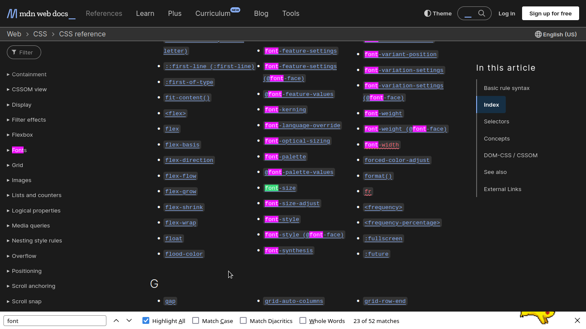

# Cách đọc Documentation

Khi làm việc với các ngôn ngữ lập trình và thư viện phần mềm, hẳn bạn từng được khuyên “hãy đọc documentation” để hiểu cách sử dụng một công cụ nào đó. Tuy nhiên, như bạn có thể từng trải qua, các tài liệu này đôi khi có thể rất choáng ngợp, dài dòng, phức tạp và khó hiểu.

Việc học cách đọc documentation là một kỹ năng quan trọng – nhưng cũng cần thời gian và kinh nghiệm.

Trong bài viết này, tôi muốn chia sẻ một vài chiến lược để giúp bạn:

1. Dễ dàng vượt qua các thuật ngữ kỹ thuật phức tạp.
2. Hiểu rõ cấu trúc và phong cách viết của documentation.
3. Tự tin hơn khi đọc tài liệu kỹ thuật (documentation).
4. Hiểu được giới hạn của documentation và khi nào nên tìm thêm nguồn hỗ trợ khác.

### **Documentation là gì?**

Về cơ bản, *documentation* là tập hợp các lời giải thích về cách sử dụng một sản phẩm hay dịch vụ cụ thể. Nó giống như “sách hướng dẫn sử dụng” dành cho phần mềm. Tuy nhiên, chất lượng của nó có thể dao động từ rất chi tiết đến cực kỳ sơ sài. Thông thường, một sản phẩm càng ít người dùng hoặc càng đặc thù thì *documentation* càng ít chi tiết.

Một phần sự khó hiểu đến từ việc *documentation* phục vụ nhiều nhóm người dùng khác nhau. Nếu giải thích quá chi tiết, lập trình viên giàu kinh nghiệm có thể thấy nó rườm rà. Nếu viết quá ngắn gọn, người mới học lại dễ rối. Một tài liệu hiệu quả là tài liệu tìm được điểm cân bằng giữa chi tiết, dễ hiểu và dễ sử dụng.

### **“Getting Started” và “Reference”**

*Documentation* tốt thường có hai phần chính, được viết từ hai góc nhìn khác nhau. Hãy xem ví dụ từ [Leaflet](https://leafletjs.com/), một thư viện JavaScript cho phép nhúng bản đồ tương tác vào trang web.

Trang [Quick Start](https://leafletjs.com/examples/quick-start/) mô tả cách bắt đầu sử dụng công cụ này, bao gồm hướng dẫn cài đặt và ví dụ cơ bản. Đây là phần nhập môn dễ tiếp cận. Ngược lại, phần [reference doc](https://leafletjs.com/reference.html) giống như từ điển chứa toàn bộ danh sách hàm, phương thức, và cấu hình. Phần này ưu tiên độ chi tiết thay vì tính hướng dẫn.

Hầu hết *documentation* đều theo cấu trúc tương tự: một phần giúp bạn khởi động nhanh và một phần là danh sách lệnh đầy đủ của công cụ.

### Nghệ thuật “tra cứu” (The Art of Referencing)

Đa số *documentation* không được viết để bạn đọc tuần tự từ đầu đến cuối, mà để *tra cứu* khi cần. Khi đã quen với cấu trúc tổng thể, bạn có thể dễ dàng nhảy đến phần mình cần, thường bằng **Ctrl + F** để tìm kiếm nhanh.

Ví dụ, hãy xem [tài liệu CSS trên MDN (Mozilla Developer Network)](https://developer.mozilla.org/en-US/docs/Web/CSS/Reference). CSS dùng để định dạng giao diện trang web, và tài liệu về nó thì cực kỳ đồ sộ. Tuy nhiên, nếu bạn chỉ muốn thay đổi font chữ, chỉ cần **Ctrl + F** và gõ “font” là có thể tìm thấy mọi thông tin liên quan:

Đây là ví dụ điển hình của cách sử dụng tài liệu. Thuộc tính gốc là **font**, từ đó bạn có thể tìm các thuộc tính dẫn xuất như font-size, font-weight, hoặc [font-kerning](https://developer.mozilla.org/en-US/docs/Web/CSS/font-kerning). Tất cả những thứ này đều bắt nguồn từ thuộc tính gốc là `font`. Documentation thường đi theo hướng này: trình bày các hình thức cơ bản nhất của một lệnh, rồi sau đó mở rộng dần đến những cách sử dụng phức tạp hơn.

Khi tìm kiếm trong tài liệu, hãy bắt đầu từ trường hợp *cơ bản nhất*. Nó thường cung cấp nền tảng để bạn mở rộng dần.

### **Một vài mẹo chung khi đọc documentation**:

1. **Đừng bỏ qua phần hướng dẫn** – Nếu có tutorial, hãy dành thời gian đọc. Nó thường cung cấp bối cảnh giúp bạn dễ hiểu hơn.
2. **Đừng nản khi không hiểu** – Tài liệu có thể có phần bạn không hiểu chút nào. Đừng để điều đó làm bạn bỏ cuộc. Thay vào đó, hãy tập trung vào những phần bạn hiểu, và lần theo manh mối đó.
3. **Ưu tiên phần mềm mã nguồn mở (open-source)** – Vì ai cũng có thể xem và sửa mã nguồn, nên tài liệu (documentation) của các dự án open-source thường kỹ hơn. Chất lượng tài liệu còn quyết định sự sống còn của nhiều dự án open-source.

### **Vượt qua giới hạn của documentation**

#### *Dùng công cụ tìm kiếm*

Dù *documentation* là nguồn chính thức tốt nhất, nhưng đôi khi nó sẽ khá là phức tạp nếu bạn không biết mình đang tìm gì, nhất là khi mới học.

Vì bạn vẫn chưa rõ mình nên tìm cái gì nên khó có thể tận dụng được **Ctrl + F**. Hãy thử dùng Google hoặc các công cụ tìm kiếm khác – nhưng cần có chiến lược.

Ví dụ với CSS, bạn tạo một nút và muốn thêm khoảng trắng xung quanh nó. Làm thế nào để bạn tìm được câu trả lời? Bạn sẽ sử dụng từ khóa nào? Từ kinh nghiệm với phần mềm như Word, bạn có thể đoán là “margin”. Ngoài việc tìm trong *documentation*, bạn có thể Google: “adding margins around a button css” hoặc “adding space around a button css”. Lưu ý: bạn cần nêu rõ là bạn đang dùng ngôn ngữ hay công nghệ nào (CSS) để giới hạn kết quả tìm kiếm.

#### *Stack Overflow*

[Stack Overflow](https://stackoverflow.com) là nơi tuyệt vời để tìm lời giải, hoặc chia sẻ hiểu biết của bạn. Đây là diễn đàn hỏi & đáp có hơn 21 triệu câu hỏi lập trình. Khả năng cao là vấn đề bạn gặp đã từng có người hỏi.

Giả sử bạn tìm kiếm: “create space around a button css”. Kết quả đầu tiên không phải *documentation*, mà là [một câu hỏi trên Stack Overflow](https://stackoverflow.com/questions/37879447/padding-the-space-above-a-css-button):

Hãy đọc lướt câu hỏi để xem có đúng với vấn đề bạn gặp không. Sau đó, đọc phần trả lời và bình luận. Có thể bạn sẽ gặp vài câu trả lời cộc lốc hoặc khó chịu – điều thường thấy ở bất kỳ diễn đàn nào. Trong ví dụ này, có nhiều cách giải quyết khác nhau được đề xuất. Lưu ý rằng câu hỏi đã được đăng hơn 6 năm trước, một vài thông tin có thể đã lỗi thời. Tuy nhiên, vẫn có rất nhiều thông tin hữu ích để bạn bắt đầu.

Việc sao chép và dùng đoạn code từ Stack Overflow là rất phổ biến, thậm chí trở thành trò đùa trong cộng đồng lập trình.

Bạn không cần cố "phát minh" lại lời giải (reinvent the wheel) nếu đã có lời giải (và code chạy được) – nhưng **hãy chắc chắn rằng bạn hiểu đoạn code đó làm gì** và nó phù hợp với dự án của bạn như thế nào.

### Các mẹo khác (Bổ sung)

#### Tìm trong third-party libraries

Có thể dùng Google (Hay bất kì search engine nào) với từ khóa `site:<domain>` như hình:

### **Lời kết**

Hãy nhớ rằng *documentation* chủ yếu dùng để tra cứu chứ không phải để học từ đầu. Với người mới, công cụ tìm kiếm và Stack Overflow là điểm xuất phát tuyệt vời. Điều quan trọng là học cách *tìm ra câu trả lời*, và để làm được vậy, bạn cần học cách *đặt câu hỏi đúng*.

Tóm tắt lại, khi tìm kiếm:

1. Luôn nêu rõ ngôn ngữ/công cụ bạn đang dùng.
2. Phân tách từ khóa rõ ràng.
3. Càng cụ thể càng tốt.
4. Đừng ngại sao chép và tùy chỉnh kết quả, **nhưng** hãy hiểu rõ điều bạn đang làm.

Và khi bạn tìm được một lời giải có vẻ phù hợp, *đó là lúc* quay lại đọc *documentation* để hiểu sâu hơn về đoạn mã và công cụ bạn đang sử dụng.

### Nguồn bài viết

[Reading Documentation: A Practical Approach for Beginners](https://gcdi.commons.gc.cuny.edu/2022/10/18/reading-documentation-a-practical-approach-for-beginners/)